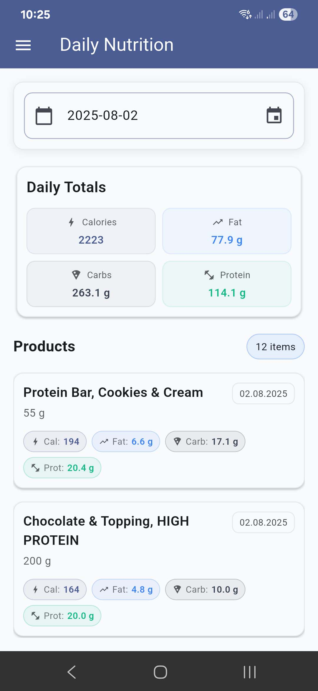
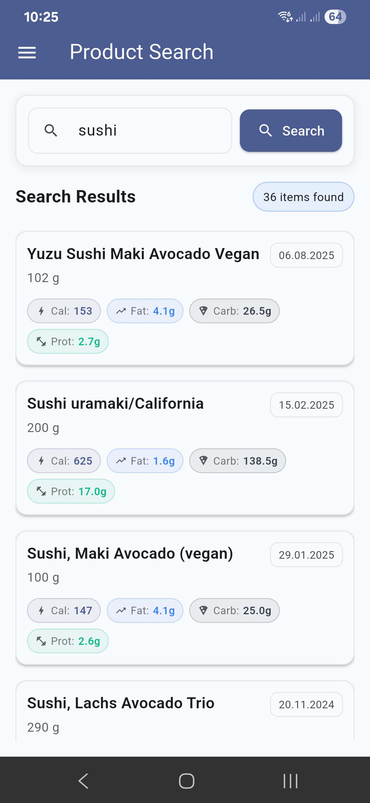
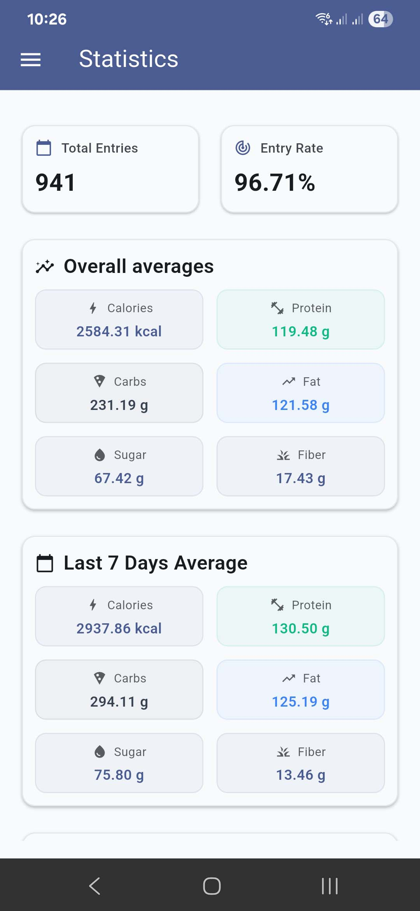
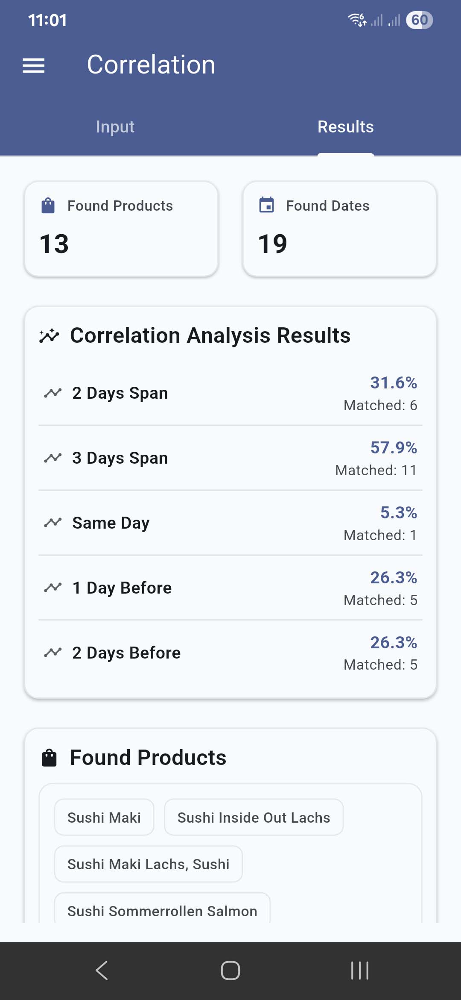

# FDDB Exporter App

This Flutter application acts as a frontend for the [FDDB Exporter](https://github.com/itobey/fddb-exporter) backend -
without the self-hosted backend this app is
not functional. It's used to comfortably call the API endpoints from an application instead of interacting with the API
yourself. You may build the application yourself or you can use the prebuilt `apk` of the released version from Github.

## Usage

The app is used as a frontend for the common API tasks of the backend application. It supports the following feature:

- Export Data: Fetch by days-back or by a date range.
- Daily Search: Retrieve daily nutrition by date.
- Product Search: Search products by name.
- Stats: View aggregated statistics.
- Correlation: Explore correlations using included/excluded keywords, start date, and occurrence dates.
- Settings: Configure API endpoint.

## Screenshots

|  |  |  |  | 
|-----------------------------------------------|-------------------------------------------------|----------------------------------------|-----------------------------------------------------|

## Configuration

- API Endpoint is configurable and stored via SharedPreferences.
- Default: `http://localhost:8080`.
- Change it in the in-app Settings screen.

## Build it yourself

### Build

- Debug: `flutter build apk --debug`
- Release: `flutter build apk --release`
- Web: `flutter build web`

### Prerequisites

- Flutter SDK: ^3.5.1
- Dart SDK: ^3.5.1
- Java 21 (Android builds)
- Android NDK 27.0.12077973 (for Android native builds)

### Setup

1. Install Flutter and Java as per versions above.
2. Clone the repository.
3. Run `flutter pub get` and `flutter build apk`.

### Testing

- Run all tests: `flutter test`
- Run a specific test: `flutter test test/export_data_widget_test.dart`

## Documentation

- API & Models: docs/api.md
- Architecture & Decisions: docs/architecture.md
- User Guide: docs/user-guide.md
- Developer Reference: docs/developer-reference.md
